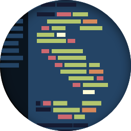

# Sublime Text Setup

> My setup for the amazing editor: [Sublime Text 3](http://www.sublimetext.com/3). Here have preferences, snippets, packages and more.

## Preferences

The *preferences* are on [Preferences.sublime-settings](/Preferences.sublime-settings).

## Packages

Whole my packages are on [packages/](packages/). But to use, you need install on the [Package Controls](https://sublime.wbond.net/) of *Sublime Text*.

## Snippets

I use some snippets to code reuse, but yet i'm work on this path, and i'll create some snippets.

*TODO - Create some snippets, and add snippets path.*

## Theme

I use as *UI Theme* the [Spacegray](http://kkga.github.io/spacegray/), is a clean and beautiful theme. And, as *Color Scheme* i use the Spacegray Ocean, it is the own color scheme of the Spacegray.

## Icon

You can see the Icon on [icons/](icons/) path, it is an awesome icon created by [Ronan Flynn](http://flynnduism.com/). For download the icons go to [project on dribbble](http://dribbble.com/shots/1067492-Sublime-Text-Icon).

## License

[MIT License](/LICENSE) © Rafael Lima
